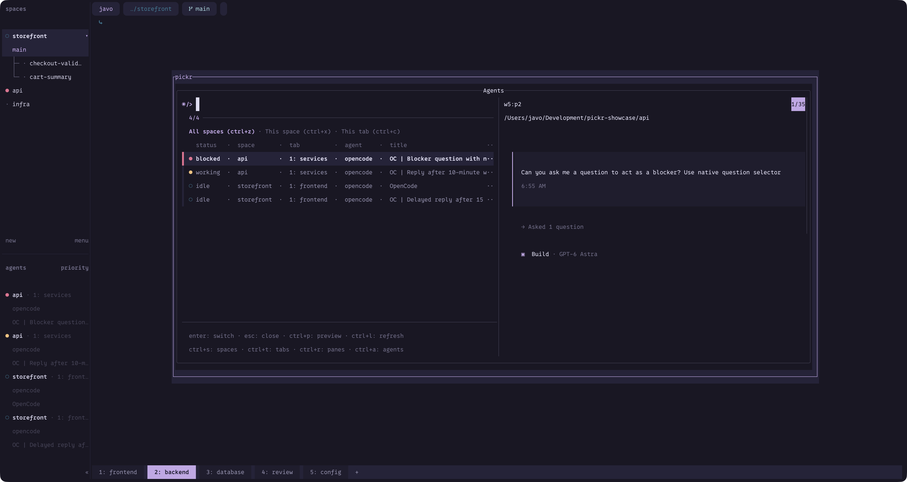
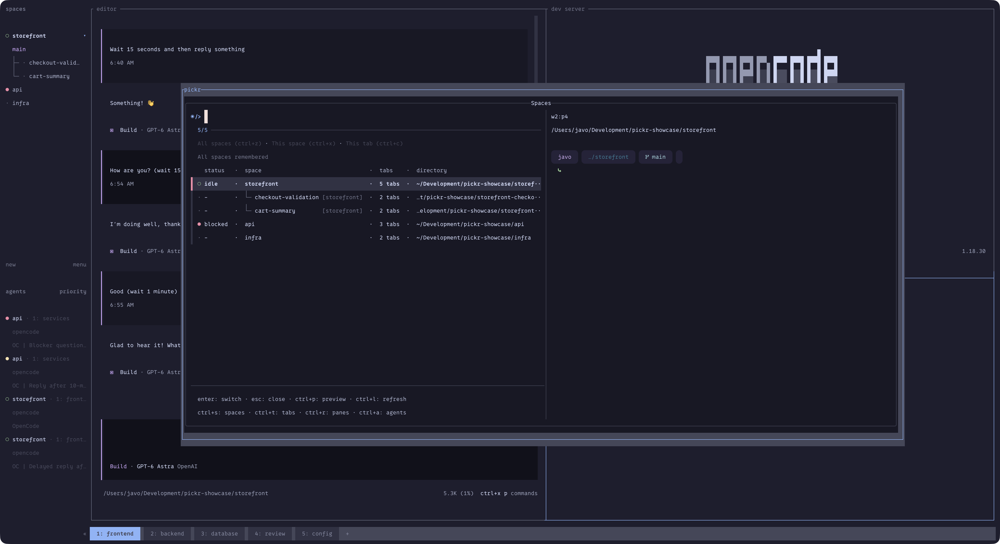
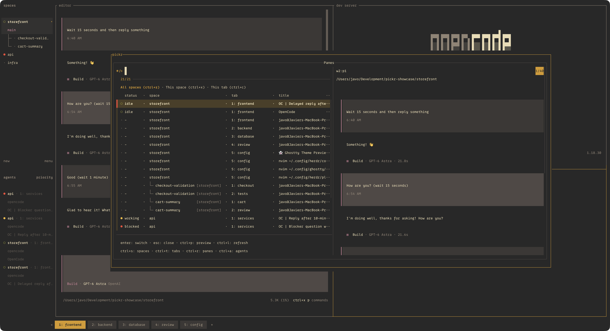
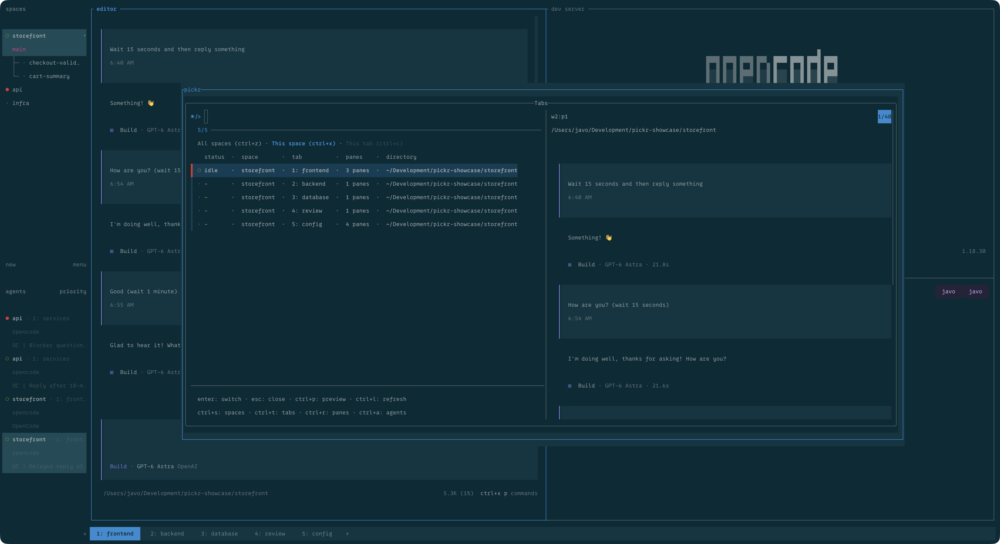
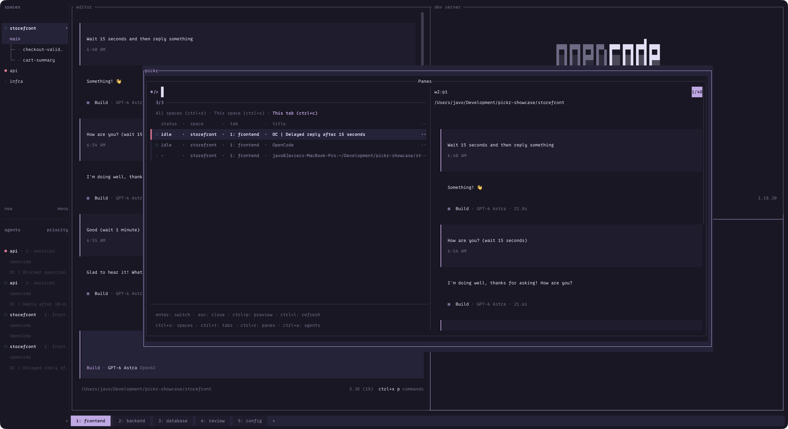

<h1 align="center">🎯 Herdr Pickr</h1>

<p align="center"><strong>YAP! Yet another picker.</strong></p>

<p align="center">
  Find your next tab, space, agent, or pane—fast.<br>
  Fuzzy pickers for <a href="https://github.com/herdrdev/herdr">Herdr</a>, with terminal previews,<br>
  fully configurable keymaps, and all 18 official Herdr 0.9.0 themes.
</p>

<p align="center">
  <a href="#pickr-in-action">In action</a> ·
  <a href="#installation">Installation</a> ·
  <a href="#configuration">Configuration</a> ·
  <a href="#themes-and-custom-colors">Themes</a> ·
  <a href="#fzf-compatibility-and-inherited-bindings">fzf compatibility</a>
</p>

- 🔎 **Four picker types, shared scopes.**
  - **Spaces** — jump between spaces.
  - **Tabs** — tabs in all spaces or the original space.
  - **Panes** — split terminals in all spaces, the original space, or the original tab.
  - **Agents** — agents in all spaces, the original space, or the original tab.
- 🧭 **Context at a glance.** Search names, directories, and pane labels; keep worktrees grouped.
- 🚦 **Attention first.** Agent statuses put blocked work and unseen completions up front.
- 👀 **Peek before you jump.** Color terminal snapshots, right in the popup.
- ⚡ **Keep your place.** Switch types, narrow scope, and refresh without leaving the picker; each type remembers its search and selection.
- 🔄 **Opt-in live updates.** Refresh candidates and the selected visible preview periodically; keep browsing while fresh data is fetched.
- 🎨 **Make it yours.** Choose and reorder columns; remap actions and tune themes, colors, prompts, size, and previews.

---

## Pickr in action

Click any image to view it full-size.

<p align="center">
  <a href="docs/images/agents-all.png"></a>
  <br>See which agents need you, and inspect their work before switching.
  <br><strong>Agents / All spaces</strong> · Showcased theme: <code>rose-pine</code>
</p>

<table>
  <tr>
    <td align="center" width="50%">
      <a href="docs/images/spaces-worktrees.png"></a>
      <br>Keep projects and their worktrees together while moving between spaces.
      <br><strong>Spaces / No scope</strong> · Showcased theme: <code>catppuccin</code> (Mocha)
    </td>
    <td align="center" width="50%">
      <a href="docs/images/panes-all.png"></a>
      <br>Find the right terminal across every project, with a preview before you jump.
      <br><strong>Panes / All spaces</strong> · Showcased theme: <code>gruvbox</code>
    </td>
  </tr>
  <tr>
    <td align="center" width="50%">
      <a href="docs/images/tabs-space.png"></a>
      <br>Search your project's tabs without losing the context of where you started.
      <br><strong>Tabs / This space</strong> · Showcased theme: <code>solarized</code>
    </td>
    <td align="center" width="50%">
      <a href="docs/images/panes-tab.png"></a>
      <br>Jump straight to the editor, tests, or logs in your current tab.
      <br><strong>Panes / This tab</strong> · Showcased theme: <code>rose-pine</code>
    </td>
  </tr>
</table>

---

## Installation

**macOS and Linux enabled.** Linux is expected to work but is untested.

### 1. Install dependencies

- **Herdr 0.9.0+**.
- **Lua 5.3+**, available as `lua` on the PATH inherited by Herdr.
- **luv**, built for that same Lua interpreter and loadable with `require("luv")`.
  A module for another Lua version or LuaJIT is not interchangeable.
- **fzf 0.74.3+**, available as `fzf` on Herdr's PATH. This is the supported
  baseline; not every later release has been tested.
- **Git**, for Herdr's GitHub installation.

On macOS, use [Homebrew](https://brew.sh/):

```sh
brew install herdr lua luv fzf git
```

On Linux, install the same dependencies for your distribution before continuing.
Use matching Lua/luv versions and make dependencies available on Herdr's PATH.

<details>
<summary>Check that Lua can load luv</summary>

Run in the environment used to launch Herdr:

```sh
lua -e 'local uv = require("luv"); print("luv loaded; libuv " .. uv.version_string())'
```

</details>

### 2. Install Pickr

Install from [GitHub](https://github.com/javoscript/herdr-pickr):

```sh
herdr plugin install javoscript/herdr-pickr
```

The unpinned command installs the latest default-branch code. To install this
release explicitly:

```sh
herdr plugin install javoscript/herdr-pickr --ref v0.3.0
```

Reinstalling preserves your plugin configuration and state. See
[CHANGELOG.md](CHANGELOG.md) for release notes and migration highlights.

### 3. Open a picker

From a terminal **inside Herdr**, open the current-space tabs picker:

```sh
herdr plugin action invoke javoscript.herdr-pickr.tabs-space
```

Move through entries to preview them, then press <kbd>Enter</kbd> to focus a selection or
<kbd>Esc</kbd> to close. Toggle previews with <kbd>Ctrl</kbd>+<kbd>P</kbd>.
Repeat the installation command to update the plugin.

Open any pane scope directly using its action:

```sh
herdr plugin action invoke javoscript.herdr-pickr.panes-tab
herdr plugin action invoke javoscript.herdr-pickr.panes-space
herdr plugin action invoke javoscript.herdr-pickr.panes-all
```

Pane views include ordinary shells, editors, agents, and plugin terminals embedded
in tab layouts, including other splits in a zoomed tab. Transient popup overlays
(including Pickr itself) and detached panes are excluded. Panes retain space/worktree,
tab, and layout order rather than agent-status priority. Preview and acceptance
target the **exact selected pane**, even in an inactive tab or space; duplicate
titles or labels do not affect targeting. A closed pane shows an unavailable
preview or a focus error rather than selecting a different terminal.

---

## Configuration

- [Keybindings](#herdr-keybindings)
- [Configuration file](#pickr-configuration-file)
- [Action keys](#popup-action-keys)
- [Hints](#keyboard-hints)
- [Columns](#displayed-columns)
- [Popup size](#popup-size)
- [Preview](#initial-preview-visibility)
- [Automatic refresh](#automatic-refresh)
- [Themes](#themes-and-custom-colors)
- [Search prompt](#search-prompt)
- [fzf compatibility](#fzf-compatibility-and-inherited-bindings)

### Herdr keybindings

Launch bindings belong in `~/.config/herdr/config.toml` (or the config path shown
by `herdr --help`). Pickr does **not** install them automatically. Add or merge
these suggested entries, replacing existing bindings on the same keys:

```toml
[[keys.command]]
key = "prefix+r"
type = "plugin_action"
command = "javoscript.herdr-pickr.tabs-space"
description = "pick tabs in current space"

[[keys.command]]
key = "prefix+shift+r"
type = "plugin_action"
command = "javoscript.herdr-pickr.tabs-all"
description = "pick tabs in all spaces"

[[keys.command]]
key = "prefix+s"
type = "plugin_action"
command = "javoscript.herdr-pickr.spaces"
description = "pick spaces"

[[keys.command]]
key = "prefix+a"
type = "plugin_action"
command = "javoscript.herdr-pickr.agents-space"
description = "pick agents in current space"

[[keys.command]]
key = "prefix+shift+a"
type = "plugin_action"
command = "javoscript.herdr-pickr.agents-all"
description = "pick agents in all spaces"

[[keys.command]]
key = "prefix+p"
type = "plugin_action"
command = "javoscript.herdr-pickr.panes-tab"
description = "pick panes in this tab"
```

Reload binding edits:

```sh
herdr server reload-config
```

Or choose **reload config** in Herdr's global menu.

All twelve actions have matching Herdr pane entrypoints. Each preset chooses the
initial type/scope in the same popup; it does not create a separate configuration
or search-memory slot. Unqualified Tabs, Panes, and Agents default to All spaces.

| Action | Picker | Initial scope |
| --- | --- | --- |
| `javoscript.herdr-pickr.spaces` | Spaces | None; remembers All spaces for a later type switch |
| `javoscript.herdr-pickr.tabs` | Tabs | All spaces |
| `javoscript.herdr-pickr.tabs-all` | Tabs | All spaces |
| `javoscript.herdr-pickr.tabs-space` | Tabs | This space |
| `javoscript.herdr-pickr.panes` | Panes | All spaces |
| `javoscript.herdr-pickr.panes-all` | Panes | All spaces |
| `javoscript.herdr-pickr.panes-space` | Panes | This space |
| `javoscript.herdr-pickr.panes-tab` | Panes | This tab |
| `javoscript.herdr-pickr.agents` | Agents | All spaces |
| `javoscript.herdr-pickr.agents-all` | Agents | All spaces |
| `javoscript.herdr-pickr.agents-space` | Agents | This space |
| `javoscript.herdr-pickr.agents-tab` | Agents | This tab |

Direct picker syntax is `lua src/main.lua spaces` or
`lua src/main.lua tabs|panes|agents [all|space|tab]` from a checkout. Tabs supports
only `all`/`space`; explicit unsupported pairs are rejected. The direct launcher
`lua src/open.lua <preset>` accepts the action suffixes in the table above.

### Pickr configuration file

Popup customization belongs in the optional `config.json` in Pickr's
Herdr-managed configuration directory. Discover that directory with:

```sh
herdr plugin config-dir javoscript.herdr-pickr
```

Create `config.json` in that directory. Here is the complete default configuration:

```json
{
  "keys": {
    "accept": ["enter"],
    "close": ["esc"],
    "toggle_preview": ["ctrl-p"],
    "refresh": ["ctrl-l"],
    "spaces": ["ctrl-s"],
    "tabs": ["ctrl-t"],
    "panes": ["ctrl-r"],
    "agents": ["ctrl-a"],
    "scope_all": ["ctrl-z"],
    "scope_space": ["ctrl-x"],
    "scope_tab": ["ctrl-c"]
  },
  "popup": {
    "width": "80%",
    "height": "70%",
    "show_hints": true
  },
  "columns": {
    "spaces": ["status", "space", "tabs", "directory"],
    "tabs": ["status", "space", "tab", "panes", "directory"],
    "panes": ["status", "space", "tab", "title", "pane", "directory"],
    "agents": ["status", "space", "tab", "agent", "title", "pane"]
  },
  "preview": {
    "enabled_by_default": true
  },
  "refresh": {
    "interval_ms": 0
  },
  "theme": {
    "name": "catppuccin",
    "custom": {}
  },
  "prompt": {
    "default": "Search: ",
    "variants": {
      "spaces": null,
      "tabs": null,
      "panes": null,
      "agents": null
    }
  }
}
```

Keep only the settings you want to change. Missing files and omitted/null values
use defaults or inheritance; an empty `theme.custom` keeps the palette unchanged.
Pickr never writes this file. Unreadable files, invalid JSON, unknown settings,
wrong types, or invalid values block launch with a file/setting diagnostic.

**Close and reopen Pickr to apply configuration or inherited fzf binding edits.**
Settings stay fixed for the session; reloading Herdr is only for launch bindings.

### Popup action keys

The `keys` object maps Pickr actions to arrays of fzf key names. These shortcuts
work **inside the popup**, without Herdr's prefix.

| Action | Default keys | Meaning |
| --- | --- | --- |
| `accept` | `["enter"]` | Focus the selected entity |
| `close` | `["esc"]` | Close without focusing |
| `toggle_preview` | `["ctrl-p"]` | Show or hide the preview |
| `refresh` | `["ctrl-l"]` | Fetch fresh candidates |
| `spaces` | `["ctrl-s"]` | All spaces |
| `tabs` | `["ctrl-t"]` | Tabs under the carried scope |
| `panes` | `["ctrl-r"]` | Panes under the carried scope |
| `agents` | `["ctrl-a"]` | Agents under the carried scope |
| `scope_all` | `["ctrl-z"]` | All spaces |
| `scope_space` | `["ctrl-x"]` | This space: the original space |
| `scope_tab` | `["ctrl-c"]` | This tab: the original tab and space |

<details>
<summary>Copy default keymap</summary>

```json
{
  "keys": {
    "accept": ["enter"],
    "close": ["esc"],
    "toggle_preview": ["ctrl-p"],
    "refresh": ["ctrl-l"],
    "spaces": ["ctrl-s"],
    "tabs": ["ctrl-t"],
    "panes": ["ctrl-r"],
    "agents": ["ctrl-a"],
    "scope_all": ["ctrl-z"],
    "scope_space": ["ctrl-x"],
    "scope_tab": ["ctrl-c"]
  }
}
```

</details>

- Arrays **replace** an action's defaults. Omitted or null values keep defaults.
- `accept` and `close` require at least one key. `[]` disables any other shortcut
  and its hint; Herdr launch actions remain available.
- Keys must be unique across all actions, including retained defaults and aliases.
  For example, `enter`/`return`/`ctrl-m` are one key, as are `tab`/`ctrl-i`.

**Ctrl+C selects This tab; Esc closes.** Ctrl+Z selects All spaces without suspending
the picker. Pickr's configured keys take precedence over inherited fzf bindings.
Conflicting Pickr overrides block launch. Remap or disable type and scope actions
independently, for example:

```json
{
  "keys": {
    "panes": ["alt-q", "f1"],
    "scope_space": ["alt-w"],
    "scope_all": []
  }
}
```

<details>
<summary>Supported key syntax and aliases (fzf 0.74.3)</summary>

- Single printable Unicode characters (case-sensitive), `alt-` plus one printable
  character, `ctrl-a` through `ctrl-z`, and `ctrl-alt-a` through `ctrl-alt-z`.
- Named keys: `enter`, `esc`, `space`, `tab`, `shift-tab`, `backspace`, `delete`,
  `insert`, `home`, `end`, `up`, `down`, `left`, `right`, `page-up`, `page-down`,
  and `f1` through `f12`.
- Special combinations: `ctrl-space`, `ctrl-^`, `ctrl-/`, `ctrl-\`, `ctrl-]`,
  `alt-enter`, `alt-space`, `alt-backspace`, `ctrl-backspace`,
  `ctrl-alt-backspace`. In JSON, a backslash must be escaped as `\\`.
- Arrow, home/end, delete, and page-up/down keys accept `alt-`, `ctrl-`, `shift-`,
  `alt-shift-`, `ctrl-alt-`, `ctrl-shift-`, or `ctrl-alt-shift-` prefixes.
- Mouse keys: `left-click`, `right-click`, `shift-left-click`, `shift-right-click`,
  `double-click`, `scroll-up`, `scroll-down`, `shift-scroll-up`,
  `shift-scroll-down`, `preview-scroll-up`, and `preview-scroll-down`.
- Aliases include `return`, `bs`/`bspace`, `del`, `pgup`/`pgdn`, `btab`,
  `ctrl-h` (<kbd>Ctrl</kbd>+<kbd>Backspace</kbd>), `ctrl-6` (`ctrl-^`), and `ctrl-_` (`ctrl-/`).
  Backspace aliases also accept `ctrl-`, `alt-`, and `ctrl-alt-`;
  `ctrl-alt-h` means `ctrl-alt-backspace`, and `alt-return`/`ctrl-alt-m` mean
  `alt-enter`. Reversed `shift-alt-`, `alt-ctrl-`, and `shift-ctrl-` prefixes
  are accepted for the modified navigation keys above.

Named keys are case-insensitive. <kbd>Ctrl</kbd>+<kbd>Shift</kbd>+letter combinations, Herdr `prefix+`
syntax, events, and fzf action expressions are not valid Pickr key names.

</details>

Each of the four picker types remembers its exact query and highlighted entity for the
lifetime of the open popup. First visits start with an empty query and the first
match. Returning to a view fetches fresh candidates and restores its query and
selection by identity, even when labels, ordering, or preview panes have changed.
If the entity was removed or no longer matches, the first match is highlighted;
zero matches leave no selection. Invoking the current view's shortcut follows
the same save-and-restore rule.

Scope changes keep the current type's query and eligible selection. If narrowing
excludes the selected entity, the first match (or none) becomes the current
selection; broadening later does not resurrect a separate scope-specific choice.
Space/tab context columns stay visible and searchable when narrowing.

The popup carries one chosen scope across types. Tabs supports All spaces and
This space; Panes and Agents also support This tab. Spaces has no effective scope.
For example, This tab in Panes becomes This space in Tabs and no scope in Spaces,
then returns to This tab in Agents. The original choice is remembered until you
explicitly choose another supported scope. Choosing This space while Tabs is
using that fallback clears the remembered tab preference without restarting the
list. Unsupported scope keys and reselecting the already chosen scope do nothing.

Narrow scopes stay anchored to where the popup was opened. This tab uses the
original tab captured at launch, even when opening Spaces first.
Highlighting another tab/space or focus changes from another client do not change
that origin. A missing or deleted original tab/space leaves its narrow scope
empty and switchable; refresh never rebinds it to a newer active tab. Moving a pane
out of the original tab removes it on refresh or return, while broader scopes can
still include it. Panes scopes share one memory slot; Agents has its own slot,
even for the same pane ID. Preview visibility
is shared across views, including toggles made during refresh. Closing the popup
through acceptance, cancellation, or failure discards all view memory; reopening
starts fresh. Separate popups keep independent memory. To clear the current
search, use ordinary query editing, such as <kbd>Ctrl</kbd>+<kbd>U</kbd> with the
cursor at the end, or an inherited `clear-query` binding on an unclaimed key.
No additional setting is needed.

Refresh retains the current results, headings, query, and preview while fetching
and preparing new candidates. You can keep typing, navigating, switching views,
or accepting a displayed result. Failure leaves those results usable and shows a
compact error with configured retry keys. Switching during a fetch or failure
saves the latest query and displayed selection and cancels source work.
Returning fetches fresh candidates rather than resuming an old refresh.

The final replacement uses native fzf identity tracking over prepared local
rows. It follows the selected ID if still matched and otherwise uses fzf's
normal fallback. **Keystrokes during this final replacement can be ignored by
fzf**; Pickr does not buffer or replay them. Herdr fetching and preview reads
are outside that input lock. A stuck replacement fails the session after a
2-second publication timeout. Accepting a displayed target that has since closed
reports a focus error rather than selecting another entity.

The fzf info counter shows matching items / total candidates in the current
view (for example, `3/9`). Its loading spinner remains visible during reloads,
but Pickr hides the temporary `+t`/`+t*` tracking indicator to avoid refresh flicker.

Acceptance still waits for explicit selection restoration on view entry;
closing, view shortcuts, query editing, and enabled preview toggling remain
available during that separate entry-restoration phase.

Footer hints show configured aliases and hide disabled actions. Controls occupy
the first row, the four type shortcuts the second; long rows clip rather than wrap.

### Migrating scope-specific settings and launch bindings

- Rename `tabs-current`, `panes-current`, and `agents-current` Herdr bindings to
  `tabs-space`, `panes-space`, and `agents-space`, then reload Herdr. The old
  `-current` registrations have been removed without compatibility aliases.
  Direct `current` scope arguments likewise become `space`.
- For direct launches, replace `lua src/main.lua workspaces all` with
  `lua src/main.lua spaces`.
- Under `keys`, `columns`, and `prompt.variants`, manually consolidate
  `tabs_current`/`tabs_all` into `tabs`, `agents_current`/`agents_all` into `agents`,
  and `panes_tab`/`panes_current`/`panes_all` into `panes`. Old leaves are rejected
  even when null or combined with new settings; Pickr does not merge overrides
  or rewrite configuration. Type shortcuts and scope shortcuts are now separate
  actions, so an old composite shortcut is not equivalent to a new type shortcut.
- The default close binding is now Esc only. If your close override includes
  Ctrl+C, remove it or remap/disable `scope_tab` to resolve the collision.
  Reopen Pickr after editing its JSON configuration.

### Keyboard hints

Scope choices appear on one non-selectable row near the search prompt. When a
picker temporarily uses a broader scope, its remembered choice (for example,
`This tab remembered`) appears on a separate line immediately below the choices.
That extra line is shown only during fallback, so the remembered choice remains
visible with the preview open. Refresh and error messages use a separate line.
Long scope rows clip instead of wrapping.

Hide the entire keyboard hints section with:

```json
{
  "popup": {
    "show_hints": false
  }
}
```

`popup.show_hints` defaults to `true`; omitted or null values keep that default.
Only booleans or null are accepted. Setting it to `false` removes both footer
rows, their separator, and the empty-list `no entries` prefix, reclaiming that
space for the list. Scope shortcut text is also hidden, but scope labels,
effective/remembered state, and refresh/error messages remain visible. Keyboard
shortcuts still work. The setting applies to all four picker types and stays fixed through
switching, refresh, and retry. Close and reopen Pickr to apply edits.

### Displayed columns

Choose the columns shown in each type and their left-to-right order:

```json
{
  "columns": {
    "tabs": ["tab", "space", "directory"],
    "agents": ["agent", "status", "title"]
  }
}
```

Each array replaces that type's complete column list at every scope. These are the available
column names, listed in their default order:

| View | Configuration key | Available columns / default order |
| --- | --- | --- |
| Spaces | `spaces` | `status`, `space`, `tabs`, `directory` |
| Tabs | `tabs` | `status`, `space`, `tab`, `panes`, `directory` |
| Panes | `panes` | `status`, `space`, `tab`, `title`, `pane`, `directory` |
| Agents | `agents` | `status`, `space`, `tab`, `agent`, `title`, `pane` |

- Omitted or null `columns` or view values keep the corresponding defaults.
  An empty `columns` object keeps all defaults.
- Lists must contain at least one column. Names are case-sensitive and must be
  unique and available in that view. Empty arrays, unknown names/views, wrong
  types, and null array elements block launch, even for inactive views.
- **Only visible columns are searchable.** Separate search terms can match
  different columns; one term cannot span column boundaries.
- The `status` glyph and text move or hide together. Worktree annotations stay
  with `space`; pane labels stay with `pane` (headed `pane [label]`). Hiding a
  column also removes its annotations from display and search.
- Column choices do not change agent priority, worktree grouping, selection, or
  preview targets. Even a single-column view remains selectable and previewable.

Pane rows use their own status (`-` when unknown), the first nonempty stripped
terminal title, terminal title, or title (`-` when missing), and foreground cwd
then cwd. Directories use the existing home abbreviation and 48-character limit.
The pane column displays `pane-id [label]`, omitting brackets for empty labels.
Pane-label and worktree annotations use the theme's annotation color. Tab/space
context remains available at every scope; narrowing never automatically hides columns.

Switching views uses the destination's configured columns. Refresh and retry keep
the session's settings; **close and reopen Pickr to apply configuration edits**.

### Popup size

```json
{
  "popup": {
    "width": "80%",
    "height": "70%"
  }
}
```

`popup.width` defaults to `"80%"`; `popup.height` defaults to `"70%"`.
Each independently accepts an integer percentage string from `"1%"` to `"100%"`
(no leading zeros), or a nonnegative finite integer cell count. Cell counts
include the outer border and are capped at 65535; Herdr clamps to its minimum
size and available terminal area. Negative or fractional counts, malformed or
out-of-range percentages, wrong types, and unknown fields are errors.

These dimensions apply to all twelve Pickr launch actions. Switching and refresh
keep the same geometry. Direct `herdr plugin pane open` calls use the manifest's
80% × 70% defaults; running the picker in an existing terminal does not resize it.

### Initial preview visibility

```json
{
  "preview": {
    "enabled_by_default": true
  }
}
```

Set `preview.enabled_by_default` to `false` to start hidden; the default is `true`.
Only booleans or null are accepted. Switching, refresh, and retry preserve toggled
visibility; reopening restores the configured default. Previews are screen
snapshots, not streams, updated on selection changes and successful refresh.

Panes and Agents preview the exact selected pane. Tabs use their remembered
focused pane; Spaces use the active tab's remembered focused pane. Refresh updates
these targets too. Missing targets show a no-pane message; unreadable panes show
an unavailable message and can recover on a later refresh. Hidden previews and
zero matches request no screen reads. A slow same-target capture is allowed to
finish while candidate refreshes continue. Native fzf preview refresh
returns the preview to the top; scroll offsets are not preserved across refreshes.

### Automatic refresh

Automatic refresh is disabled by default. To enable one-second updates:

```json
{
  "refresh": {
    "interval_ms": 1000
  }
}
```

`refresh.interval_ms` accepts finite integers from `0` through `2147483647`
milliseconds. Missing, null, or zero values disable periodic work; positive
values are used without clamping. An omitted, null, or empty `refresh` object
also keeps the default of zero. Invalid types, ranges, or unknown fields block
launch with a configuration diagnostic.

The first attempt occurs one interval after the view is ready. The interval is
an attempt cadence, not a guarantee of exact publication timing. Only one
candidate refresh runs at a time; busy ticks and manual triggers are skipped
without queued catch-up. Manual refresh does not reset the cadence. Type or
effective-scope transitions start a fresh cadence after destination readiness;
a scope choice that leaves the effective scope unchanged does not restart it.

Routine automatic refreshes do not show a `Refreshing…` status line, keeping
the scope header and results list from shifting on every tick. Manual refresh
still shows progress, and refresh failures still show an error until recovery.

All four types and their supported scopes use the same interval. Empty lists,
zero matches, hidden previews, and `keys.refresh: []` do not suspend automatic
list updates. Successful updates renew the selected visible preview even when
row text is unchanged. Automatic attempts continue after recoverable failures;
the error remains visible until successful recovery. Each popup owns its timer,
which is disposed on acceptance, close, or transition.

**Close and reopen Pickr to apply interval edits.** The resolved value stays
fixed through launcher handoff, type/scope changes, refresh, and retry.

### Themes and custom colors

`theme.name` defaults to `catppuccin` (Mocha), independently of Herdr's active
client theme. Choose a palette and optionally override individual colors:

```json
{
  "theme": {
    "name": "rose-pine",
    "custom": {
      "annotation": "#abc",
      "status_blocked": "rgb(255, 120, 140)",
      "preview_border": "lightblue"
    }
  }
}
```

Supported themes (case-sensitive): `catppuccin`, `catppuccin-latte`, `terminal`,
`tokyo-night`, `tokyo-night-day`, `dracula`, `nord`, `gruvbox`, `gruvbox-light`,
`one-dark`, `one-light`, `solarized`, `solarized-light`, `kanagawa`,
`kanagawa-lotus`, `rose-pine`, `rose-pine-dawn`, and `vesper`.

> [!NOTE]
> Pickr cannot automatically match Herdr's active theme. For a consistent look,
> set Pickr's `theme.name` to the same theme you use in Herdr.

Palettes are bundled for offline use. `terminal` uses ANSI colors and terminal
defaults. Omitted/null `theme.name` uses Catppuccin; omitted/null custom roles
or `theme.custom` retain the selected palette's colors.

All 24 semantic roles can be overridden in `theme.custom`:

| Area | Roles |
| --- | --- |
| List | `background`, `foreground`, `selected_background`, `selected_foreground`, `match`, `selected_match` |
| Controls | `info`, `marker`, `prompt`, `spinner`, `pointer` |
| Chrome | `header`, `footer`, `border`, `label` |
| Preview | `preview_background`, `preview_foreground`, `preview_border` |
| Context | `annotation`, `status_blocked`, `status_done`, `status_working`, `status_idle`, `status_unknown` |

Accepted color strings:

- Hex: `#RGB` or `#RRGGBB`.
- RGB: `rgb(r,g,b)` with integer components from 0 through 255; component
  whitespace and optional leading `+` signs are accepted.
- ANSI names: `black`, `red`, `green`, `yellow`, `blue`, `magenta`/`purple`,
  `cyan`, `white`, `gray`/`grey`, `darkgray`/`darkgrey`, `lightred`, `lightgreen`,
  `lightyellow`, `lightblue`, `lightmagenta`, and `lightcyan`.
- Terminal-default aliases: `reset`, `default`, `none`, `transparent`.
  These mean terminal-default color, not alpha blending.

Color case and surrounding whitespace are normalized. Unknown themes/roles and
invalid colors are errors. Colors style rows, annotations, and preview chrome;
captured terminal colors are preserved. Themes do not change search or selection.

### Search prompt

Every view defaults to exactly `"Search: "`, including the trailing space. Set
`prompt.default` to change the text globally:

```json
{
  "prompt": {
    "default": "Search: "
  }
}
```

Default per-type settings (`null` inherits the global prompt):

```json
{
  "prompt": {
    "default": "Search: ",
    "variants": {
      "spaces": null,
      "tabs": null,
      "panes": null,
      "agents": null
    }
  }
}
```

`prompt.default` applies to every view; omitted/null `prompt` or `prompt.default`
uses `"Search: "`. Set a variant above to override it. Omitted/null `prompt.variants`
or individual variants inherit the global prompt. Use `""` to hide the prompt.

Text is literal: spaces, Unicode, quotes, and metacharacters are preserved, never
evaluated. NUL, carriage return, and newline are rejected. Invalid types, fields,
or variant names block launch, even for inactive views.

Switching type selects the destination's prompt; scope changes, refresh, and retry keep it unchanged.
**Text:** `prompt.default`/`prompt.variants`. **Color:** `theme.custom.prompt`.

### fzf compatibility and inherited bindings

> [!WARNING]
> Pickr imports only the supported fzf bindings listed below. Other ambient
> options—including preview commands, prompts, colors, output, selection, and
> listen settings—are ignored. Pickr's action keys and lifecycle events win.

Requires **fzf 0.74.3+**. Remapping or disabling a Pickr action frees its key for
an inherited navigation/editing binding.

Sources are read in this order:

1. The file named by `FZF_DEFAULT_OPTS_FILE`.
2. `FZF_DEFAULT_OPTS`.

Both `--bind VALUE` and `--bind=VALUE` are recognized. Later assignments replace
earlier bindings on the same effective key, including aliases. A leading `+`
appends to the earlier explicit action chain, not fzf's built-in default binding.
For example, `--bind 'alt-j:down,alt-k:up'` in either source works when those keys
are unclaimed. General fzf bindings belong in these sources; Pickr's JSON `keys`
object only configures the eleven Pickr actions.

Quoting, comments, separator keys, and action chains follow fzf 0.74.3 parsing;
option text is not shell-evaluated or expanded. Only argument-free actions from
the inventory below, or ordered `+` chains of those actions, are imported.

<details>
<summary>Complete supported imported-action inventory</summary>

- **Navigation:** `up`, `down`, `up-match`, `down-match`, `first`, `top`, `last`,
  `best`, `page-up`, `page-down`, `half-page-up`, `half-page-down`, `offset-up`,
  `offset-down`, `offset-middle`.
- **Query editing:** `beginning-of-line`, `end-of-line`, `backward-char`,
  `forward-char`, `backward-word`, `forward-word`, `backward-subword`,
  `forward-subword`, `backward-delete-char`, `delete-char`, `clear-query`,
  `kill-line`, `kill-word`, `kill-subword`, `backward-kill-word`,
  `backward-kill-subword`, `unix-line-discard`, `line-discard`,
  `unix-word-rubout`, `word-rubout`, `yank`.
- **Preview scrolling:** `preview-top`, `preview-bottom`, `preview-up`,
  `preview-down`, `preview-page-up`, `preview-page-down`,
  `preview-half-page-up`, `preview-half-page-down`.
- **No-op:** `ignore`.

</details>

An event binding, unsupported key, or chain containing any unsupported action
excludes the **whole effective binding**. Excluded actions include `execute`,
`accept`, `abort`, `reload`, `transform`, preview visibility changes, and `/eof`
editing actions. An excluded later assignment does not revive an older binding;
other supported bindings still apply.

Malformed bindings, malformed option sources, unreadable option files, and
excluded bindings produce non-blocking `Pickr fzf:` diagnostics identifying the
source and, where applicable, the key/event/action. Malformed bindings are skipped;
malformed source quoting skips that source, while other sources can still
contribute bindings. Blocking JSON configuration diagnostics use `Pickr:` and
identify the file/setting. Inspect action-launch diagnostics with:

```sh
herdr plugin log list --plugin javoscript.herdr-pickr --limit 5
```

---

## License and attribution

Pickr is [MIT-licensed](LICENSE), Copyright © 2026 javoscript.
Bundled [rxi/json.lua](https://github.com/rxi/json.lua) 0.1.2 retains its
[MIT notice](src/pickr/vendor/json.lua), Copyright © 2020 rxi.
Theme palettes are adapted from [Herdr 0.9.0](https://github.com/herdrdev/herdr/blob/v0.9.0/src/app/state.rs)
under [Apache-2.0](src/pickr/vendor/HERDR-LICENSE).
