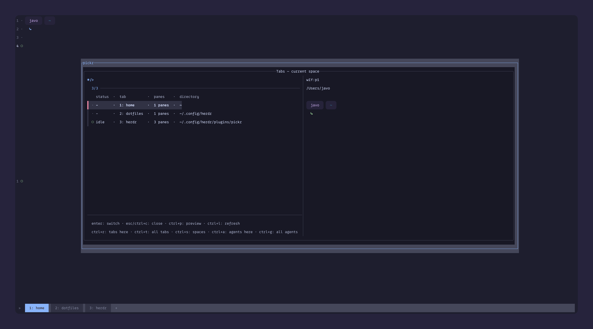
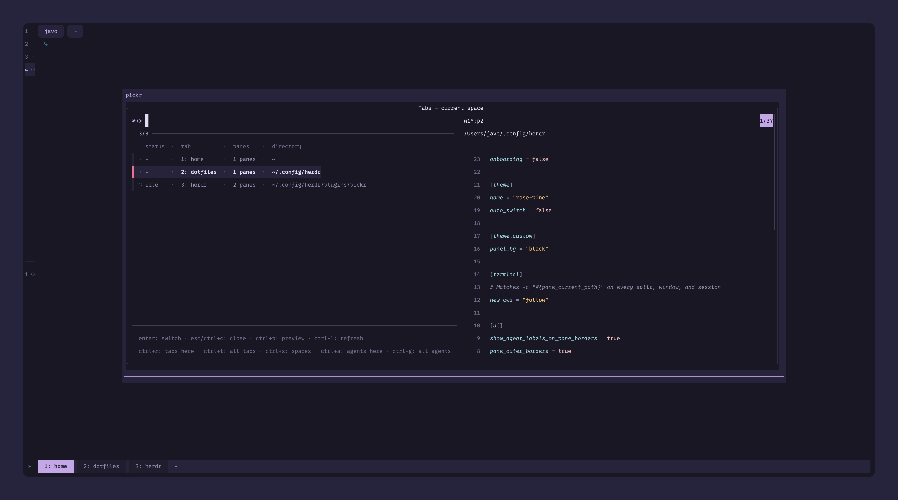
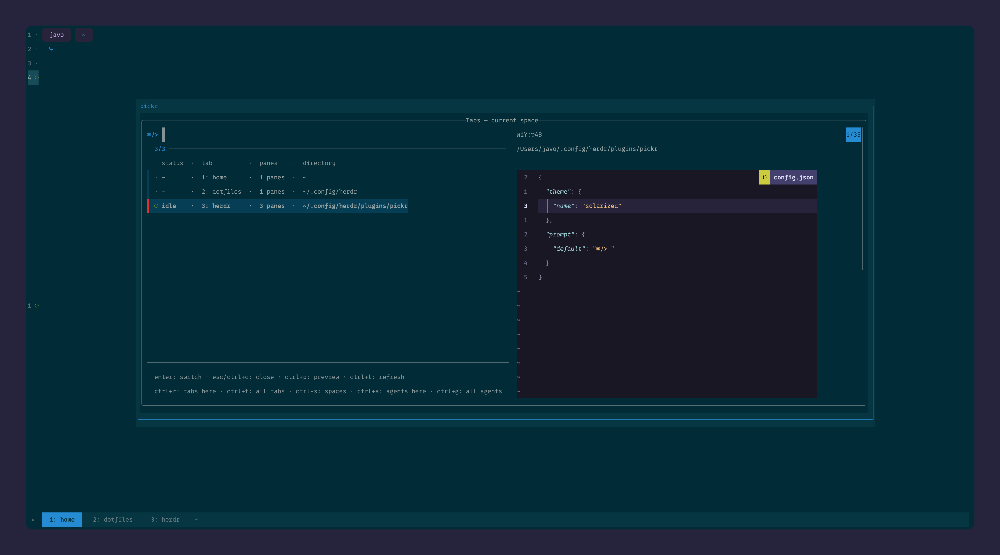
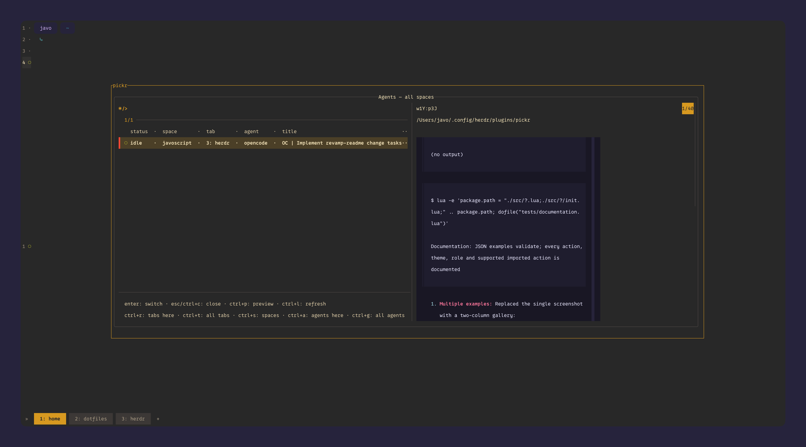

<h1 align="center">🎯 Herdr Pickr</h1>

<p align="center"><strong>YAP! Yet another picker.</strong></p>

<p align="center">
  Find your next tab, space, or agent—fast.<br>
  Fuzzy pickers for <a href="https://github.com/herdrdev/herdr">Herdr</a>, with terminal previews,<br>
  fully configurable keymaps, and all 18 official Herdr 0.9.0 themes.
</p>

<p align="center">
  <a href="#installation">Installation</a> ·
  <a href="#configuration">Configuration</a> ·
  <a href="#themes-and-custom-colors">Themes</a> ·
  <a href="#fzf-compatibility-and-inherited-bindings">fzf compatibility</a>
</p>

- 🔎 **Five views.**
  - **Spaces** — jump between spaces.
  - **All tabs** — tabs across every space.
  - **Tabs here** — tabs in the current space.
  - **All agents** — agents across every space.
  - **Agents here** — agents in the current space.
- 🧭 **Context at a glance.** Search names, directories, and pane labels; keep worktrees grouped.
- 🚦 **Attention first.** Agent statuses put blocked work and unseen completions up front.
- 👀 **Peek before you jump.** Color terminal snapshots, right in the popup.
- ⚡ **Keep moving.** Switch views and refresh without leaving the picker.
- 🎨 **Make it yours.** Remap every action; tune themes, colors, prompts, size, and previews.

---

## Theme spotlight

Click a screenshot to view it full-size. These examples use a [custom prompt](#search-prompt).

<table>
  <tr>
    <td align="center" width="50%">
      <a href="docs/images/catppuccin.png"></a>
      <br><code>catppuccin</code> (Mocha) · Current-space tabs
    </td>
    <td align="center" width="50%">
      <a href="docs/images/rose-pine.png"></a>
      <br><code>rose-pine</code> · Current-space tabs
    </td>
  </tr>
  <tr>
    <td align="center" width="50%">
      <a href="docs/images/solarized.png"></a>
      <br><code>solarized</code> · Current-space tabs
    </td>
    <td align="center" width="50%">
      <a href="docs/images/gruvbox.png"></a>
      <br><code>gruvbox</code> · All-spaces agents
    </td>
  </tr>
</table>

---

## Installation

**macOS and Linux enabled.** Linux is expected to work but is untested.

### 1. Install dependencies

- **Herdr 0.9.0+**.
- **Lua 5.3+**, available as `lua` on the PATH inherited by Herdr.
- **luv**, built for that same Lua interpreter and loadable with `require("luv")`.
  A module for another Lua version or LuaJIT is not interchangeable.
- **fzf 0.74.3+**, available as `fzf` on Herdr's PATH. This is the supported
  baseline; not every later release has been tested.
- **Git**, for Herdr's GitHub installation.

On macOS, use [Homebrew](https://brew.sh/):

```sh
brew install herdr lua luv fzf git
```

On Linux, install the same dependencies for your distribution before continuing.
Use matching Lua/luv versions and make dependencies available on Herdr's PATH.

<details>
<summary>Check that Lua can load luv</summary>

Run in the environment used to launch Herdr:

```sh
lua -e 'local uv = require("luv"); print("luv loaded; libuv " .. uv.version_string())'
```

</details>

### 2. Install Pickr

Install from [GitHub](https://github.com/javoscript/herdr-pickr):

```sh
herdr plugin install javoscript/herdr-pickr
```

### 3. Open a picker

From a terminal **inside Herdr**, open the current-space tabs picker:

```sh
herdr plugin action invoke javoscript.herdr-pickr.tabs-current
```

Move through entries to preview them, then press <kbd>Enter</kbd> to focus a selection or
<kbd>Esc</kbd> to close. Toggle previews with <kbd>Ctrl</kbd>+<kbd>P</kbd>.
Repeat the installation command to update the plugin.

---

## Configuration

<p align="center">
  <a href="#herdr-keybindings">Keybindings</a> ·
  <a href="#pickr-configuration-file">Configuration file</a> ·
  <a href="#popup-action-keys">Action keys</a> ·
  <a href="#popup-size">Popup size</a> ·
  <a href="#initial-preview-visibility">Preview</a> ·
  <a href="#themes-and-custom-colors">Themes</a> ·
  <a href="#search-prompt">Search prompt</a> ·
  <a href="#fzf-compatibility-and-inherited-bindings">fzf compatibility</a>
</p>

### Herdr keybindings

Launch bindings belong in `~/.config/herdr/config.toml` (or the config path shown
by `herdr --help`). Pickr does **not** install them automatically. Add or merge
these suggested entries, replacing existing bindings on the same keys:

```toml
[[keys.command]]
key = "prefix+r"
type = "plugin_action"
command = "javoscript.herdr-pickr.tabs-current"
description = "pick tabs in current space"

[[keys.command]]
key = "prefix+shift+r"
type = "plugin_action"
command = "javoscript.herdr-pickr.tabs-all"
description = "pick tabs in all spaces"

[[keys.command]]
key = "prefix+s"
type = "plugin_action"
command = "javoscript.herdr-pickr.spaces"
description = "pick spaces"

[[keys.command]]
key = "prefix+a"
type = "plugin_action"
command = "javoscript.herdr-pickr.agents-current"
description = "pick agents in current space"

[[keys.command]]
key = "prefix+shift+a"
type = "plugin_action"
command = "javoscript.herdr-pickr.agents-all"
description = "pick agents in all spaces"
```

Reload binding edits:

```sh
herdr server reload-config
```

Or choose **reload config** in Herdr's global menu.

### Pickr configuration file

Popup customization belongs in the optional `config.json` in Pickr's
Herdr-managed configuration directory. Discover that directory with:

```sh
herdr plugin config-dir javoscript.herdr-pickr
```

Create `config.json` in that directory. Here is the complete default configuration:

```json
{
  "keys": {
    "accept": ["enter"],
    "close": ["esc", "ctrl-c"],
    "toggle_preview": ["ctrl-p"],
    "refresh": ["ctrl-l"],
    "tabs_current": ["ctrl-r"],
    "tabs_all": ["ctrl-t"],
    "spaces": ["ctrl-s"],
    "agents_current": ["ctrl-a"],
    "agents_all": ["ctrl-g"]
  },
  "popup": {
    "width": "80%",
    "height": "70%"
  },
  "preview": {
    "enabled_by_default": true
  },
  "theme": {
    "name": "catppuccin",
    "custom": {}
  },
  "prompt": {
    "default": "Search: ",
    "variants": {
      "tabs_current": null,
      "tabs_all": null,
      "spaces": null,
      "agents_current": null,
      "agents_all": null
    }
  }
}
```

Keep only the settings you want to change. Missing files and omitted/null values
use defaults or inheritance; an empty `theme.custom` keeps the palette unchanged.
Pickr never writes this file. Unreadable files, invalid JSON, unknown settings,
wrong types, or invalid values block launch with a file/setting diagnostic.

**Close and reopen Pickr to apply configuration or inherited fzf binding edits.**
Settings stay fixed for the session; reloading Herdr is only for launch bindings.

### Popup action keys

The `keys` object maps Pickr actions to arrays of fzf key names. These shortcuts
work **inside the popup**, without Herdr's prefix.

| Action | Default keys | Meaning |
| --- | --- | --- |
| `accept` | `["enter"]` | Focus the selected entity |
| `close` | `["esc", "ctrl-c"]` | Close without focusing |
| `toggle_preview` | `["ctrl-p"]` | Show or hide the preview |
| `refresh` | `["ctrl-l"]` | Fetch fresh candidates |
| `tabs_current` | `["ctrl-r"]` | Tabs in the original current space |
| `tabs_all` | `["ctrl-t"]` | Tabs in all spaces |
| `spaces` | `["ctrl-s"]` | All spaces |
| `agents_current` | `["ctrl-a"]` | Agents in the original current space |
| `agents_all` | `["ctrl-g"]` | Agents in all spaces |

<details>
<summary>Copy default keymap</summary>

```json
{
  "keys": {
    "accept": ["enter"],
    "close": ["esc", "ctrl-c"],
    "toggle_preview": ["ctrl-p"],
    "refresh": ["ctrl-l"],
    "tabs_current": ["ctrl-r"],
    "tabs_all": ["ctrl-t"],
    "spaces": ["ctrl-s"],
    "agents_current": ["ctrl-a"],
    "agents_all": ["ctrl-g"]
  }
}
```

</details>

- Arrays **replace** an action's defaults. Omitted or null values keep defaults.
- `accept` and `close` require at least one key. `[]` disables any other shortcut
  and its hint; Herdr launch actions remain available.
- Keys must be unique across all actions, including retained defaults and aliases.
  For example, `enter`/`return`/`ctrl-m` are one key, as are `tab`/`ctrl-i`.

<details>
<summary>Supported key syntax and aliases (fzf 0.74.3)</summary>

- Single printable Unicode characters (case-sensitive), `alt-` plus one printable
  character, `ctrl-a` through `ctrl-z`, and `ctrl-alt-a` through `ctrl-alt-z`.
- Named keys: `enter`, `esc`, `space`, `tab`, `shift-tab`, `backspace`, `delete`,
  `insert`, `home`, `end`, `up`, `down`, `left`, `right`, `page-up`, `page-down`,
  and `f1` through `f12`.
- Special combinations: `ctrl-space`, `ctrl-^`, `ctrl-/`, `ctrl-\`, `ctrl-]`,
  `alt-enter`, `alt-space`, `alt-backspace`, `ctrl-backspace`,
  `ctrl-alt-backspace`. In JSON, a backslash must be escaped as `\\`.
- Arrow, home/end, delete, and page-up/down keys accept `alt-`, `ctrl-`, `shift-`,
  `alt-shift-`, `ctrl-alt-`, `ctrl-shift-`, or `ctrl-alt-shift-` prefixes.
- Mouse keys: `left-click`, `right-click`, `shift-left-click`, `shift-right-click`,
  `double-click`, `scroll-up`, `scroll-down`, `shift-scroll-up`,
  `shift-scroll-down`, `preview-scroll-up`, and `preview-scroll-down`.
- Aliases include `return`, `bs`/`bspace`, `del`, `pgup`/`pgdn`, `btab`,
  `ctrl-h` (<kbd>Ctrl</kbd>+<kbd>Backspace</kbd>), `ctrl-6` (`ctrl-^`), and `ctrl-_` (`ctrl-/`).
  Backspace aliases also accept `ctrl-`, `alt-`, and `ctrl-alt-`;
  `ctrl-alt-h` means `ctrl-alt-backspace`, and `alt-return`/`ctrl-alt-m` mean
  `alt-enter`. Reversed `shift-alt-`, `alt-ctrl-`, and `shift-ctrl-` prefixes
  are accepted for the modified navigation keys above.

Named keys are case-insensitive. <kbd>Ctrl</kbd>+<kbd>Shift</kbd>+letter combinations, Herdr `prefix+`
syntax, events, and fzf action expressions are not valid Pickr key names.

</details>

Switching views resets the query; refresh preserves it and the selection when
still matched. Current-space views stay scoped to where the popup was opened.
During refresh, accept/refresh keys are disabled; after failure, refresh retries
and acceptance stays disabled until success.

Footer hints show configured aliases and hide disabled actions. Controls occupy
the first row, view shortcuts the second; long rows clip rather than wrap.

### Popup size

```json
{
  "popup": {
    "width": "80%",
    "height": "70%"
  }
}
```

`popup.width` defaults to `"80%"`; `popup.height` defaults to `"70%"`.
Each independently accepts an integer percentage string from `"1%"` to `"100%"`
(no leading zeros), or a nonnegative finite integer cell count. Cell counts
include the outer border and are capped at 65535; Herdr clamps to its minimum
size and available terminal area. Negative or fractional counts, malformed or
out-of-range percentages, wrong types, and unknown fields are errors.

These dimensions apply to all five Pickr launch actions. Switching and refresh
keep the same geometry. Direct `herdr plugin pane open` calls use the manifest's
80% × 70% defaults; running the picker in an existing terminal does not resize it.

### Initial preview visibility

```json
{
  "preview": {
    "enabled_by_default": true
  }
}
```

Set `preview.enabled_by_default` to `false` to start hidden; the default is `true`.
Only booleans or null are accepted. Switching, refresh, and retry preserve toggled
visibility; reopening restores the configured default. Previews are screen
snapshots, not streams, updated on selection changes and successful refresh.

### Themes and custom colors

`theme.name` defaults to `catppuccin` (Mocha), independently of Herdr's active
client theme. Choose a palette and optionally override individual colors:

```json
{
  "theme": {
    "name": "rose-pine",
    "custom": {
      "annotation": "#abc",
      "status_blocked": "rgb(255, 120, 140)",
      "preview_border": "lightblue"
    }
  }
}
```

Supported themes (case-sensitive): `catppuccin`, `catppuccin-latte`, `terminal`,
`tokyo-night`, `tokyo-night-day`, `dracula`, `nord`, `gruvbox`, `gruvbox-light`,
`one-dark`, `one-light`, `solarized`, `solarized-light`, `kanagawa`,
`kanagawa-lotus`, `rose-pine`, `rose-pine-dawn`, and `vesper`.

> [!NOTE]
> Pickr cannot automatically match Herdr's active theme. For a consistent look,
> set Pickr's `theme.name` to the same theme you use in Herdr.

Palettes are bundled for offline use. `terminal` uses ANSI colors and terminal
defaults. Omitted/null `theme.name` uses Catppuccin; omitted/null custom roles
or `theme.custom` retain the selected palette's colors.

All 24 semantic roles can be overridden in `theme.custom`:

| Area | Roles |
| --- | --- |
| List | `background`, `foreground`, `selected_background`, `selected_foreground`, `match`, `selected_match` |
| Controls | `info`, `marker`, `prompt`, `spinner`, `pointer` |
| Chrome | `header`, `footer`, `border`, `label` |
| Preview | `preview_background`, `preview_foreground`, `preview_border` |
| Context | `annotation`, `status_blocked`, `status_done`, `status_working`, `status_idle`, `status_unknown` |

Accepted color strings:

- Hex: `#RGB` or `#RRGGBB`.
- RGB: `rgb(r,g,b)` with integer components from 0 through 255; component
  whitespace and optional leading `+` signs are accepted.
- ANSI names: `black`, `red`, `green`, `yellow`, `blue`, `magenta`/`purple`,
  `cyan`, `white`, `gray`/`grey`, `darkgray`/`darkgrey`, `lightred`, `lightgreen`,
  `lightyellow`, `lightblue`, `lightmagenta`, and `lightcyan`.
- Terminal-default aliases: `reset`, `default`, `none`, `transparent`.
  These mean terminal-default color, not alpha blending.

Color case and surrounding whitespace are normalized. Unknown themes/roles and
invalid colors are errors. Colors style rows, annotations, and preview chrome;
captured terminal colors are preserved. Themes do not change search or selection.

### Search prompt

Every view defaults to exactly `"Search: "`, including the trailing space. Set
`prompt.default` to change the text globally:

```json
{
  "prompt": {
    "default": "Search: "
  }
}
```

Default per-view settings (`null` inherits the global prompt):

```json
{
  "prompt": {
    "default": "Search: ",
    "variants": {
      "tabs_current": null,
      "tabs_all": null,
      "spaces": null,
      "agents_current": null,
      "agents_all": null
    }
  }
}
```

`prompt.default` applies to every view; omitted/null `prompt` or `prompt.default`
uses `"Search: "`. Set a variant above to override it. Omitted/null `prompt.variants`
or individual variants inherit the global prompt. Use `""` to hide the prompt.

Text is literal: spaces, Unicode, quotes, and metacharacters are preserved, never
evaluated. NUL, carriage return, and newline are rejected. Invalid types, fields,
or variant names block launch, even for inactive views.

Switching selects the destination's prompt; refresh and retry keep it unchanged.
**Text:** `prompt.default`/`prompt.variants`. **Color:** `theme.custom.prompt`.

### fzf compatibility and inherited bindings

> [!WARNING]
> Pickr imports only the supported fzf bindings listed below. Other ambient
> options—including preview commands, prompts, colors, output, selection, and
> listen settings—are ignored. Pickr's action keys and lifecycle events win.

Requires **fzf 0.74.3+**. Remapping or disabling a Pickr action frees its key for
an inherited navigation/editing binding.

Sources are read in this order:

1. The file named by `FZF_DEFAULT_OPTS_FILE`.
2. `FZF_DEFAULT_OPTS`.

Both `--bind VALUE` and `--bind=VALUE` are recognized. Later assignments replace
earlier bindings on the same effective key, including aliases. A leading `+`
appends to the earlier explicit action chain, not fzf's built-in default binding.
For example, `--bind 'alt-j:down,alt-k:up'` in either source works when those keys
are unclaimed. General fzf bindings belong in these sources; Pickr's JSON `keys`
object only configures the nine Pickr actions.

Quoting, comments, separator keys, and action chains follow fzf 0.74.3 parsing;
option text is not shell-evaluated or expanded. Only argument-free actions from
the inventory below, or ordered `+` chains of those actions, are imported.

<details>
<summary>Complete supported imported-action inventory</summary>

- **Navigation:** `up`, `down`, `up-match`, `down-match`, `first`, `top`, `last`,
  `best`, `page-up`, `page-down`, `half-page-up`, `half-page-down`, `offset-up`,
  `offset-down`, `offset-middle`.
- **Query editing:** `beginning-of-line`, `end-of-line`, `backward-char`,
  `forward-char`, `backward-word`, `forward-word`, `backward-subword`,
  `forward-subword`, `backward-delete-char`, `delete-char`, `clear-query`,
  `kill-line`, `kill-word`, `kill-subword`, `backward-kill-word`,
  `backward-kill-subword`, `unix-line-discard`, `line-discard`,
  `unix-word-rubout`, `word-rubout`, `yank`.
- **Preview scrolling:** `preview-top`, `preview-bottom`, `preview-up`,
  `preview-down`, `preview-page-up`, `preview-page-down`,
  `preview-half-page-up`, `preview-half-page-down`.
- **No-op:** `ignore`.

</details>

An event binding, unsupported key, or chain containing any unsupported action
excludes the **whole effective binding**. Excluded actions include `execute`,
`accept`, `abort`, `reload`, `transform`, preview visibility changes, and `/eof`
editing actions. An excluded later assignment does not revive an older binding;
other supported bindings still apply.

Malformed bindings, malformed option sources, unreadable option files, and
excluded bindings produce non-blocking `Pickr fzf:` diagnostics identifying the
source and, where applicable, the key/event/action. Malformed bindings are skipped;
malformed source quoting skips that source, while other sources can still
contribute bindings. Blocking JSON configuration diagnostics use `Pickr:` and
identify the file/setting. Inspect action-launch diagnostics with:

```sh
herdr plugin log list --plugin javoscript.herdr-pickr --limit 5
```

---

## License and attribution

Pickr is [MIT-licensed](LICENSE), Copyright © 2026 javoscript.
Bundled [rxi/json.lua](https://github.com/rxi/json.lua) 0.1.2 retains its
[MIT notice](src/pickr/vendor/json.lua), Copyright © 2020 rxi.
Theme palettes are adapted from [Herdr 0.9.0](https://github.com/herdrdev/herdr/blob/v0.9.0/src/app/state.rs)
under [Apache-2.0](src/pickr/vendor/HERDR-LICENSE).
